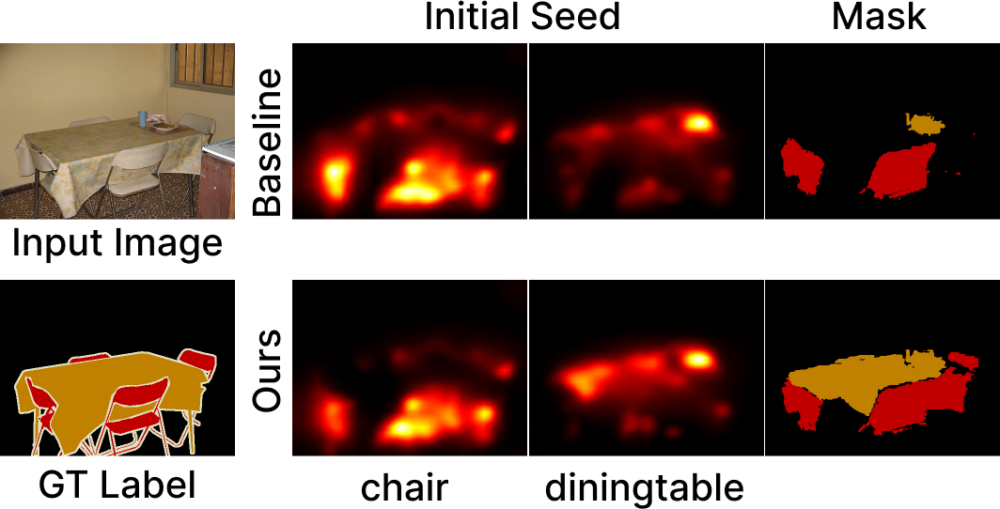

# Single Label Dataset for Weakly Supervised Semantic Segmentation.

**Final project of "Bigdata computing (AIE6202)" with team 2.**

Date: 2022.12.15

Codes heavily build on [IRN](https://github.com/jiwoon-ahn/irn) and [W-OoD](https://github.com/naver-ai/w-ood). Thanks for sharing this awesome code!

> **Abstract**: Weakly supervised semantic segmentation (WSSS) effectively reduce the pixel-level annotation cost since they use weak labels such as image-level labels.
> Although numerous studies have been conducted, they do not attention to the strong correlation between classes.
> In this paper, we analyze that a strong correlation between classes makes a poor localization map. Also, we handle this issue by using Single Label Dataset (SLD).
> To train this dataset more suitable for the classification model, we proposed a novel knowledge distillation method that makes the two networks complementary. Notably, we design several experiments to show the effectiveness of our method using qualitative and quantitative analysis.

# Single Label Dataset
Command and explanations of Single Label Dataset are to be determined.

Download here: https://drive.google.com/file/d/1ReLIna_dJvwA3hx7lWMFw8pni3LXKuub/view?usp=share_link
